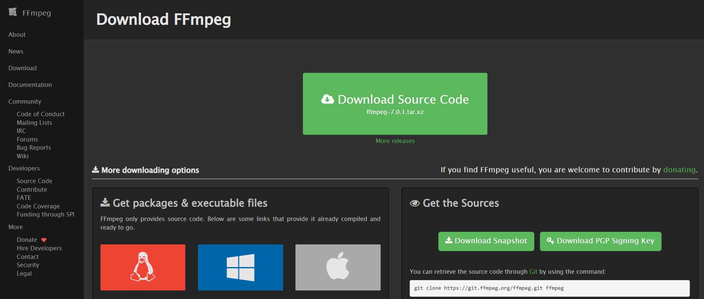

# Audio Converter to WAV

Audio Converter to WAV is a specialized project dedicated to converting various audio formats to WAV. It operates by taking an input audio file and converting it to a high-quality WAV format. This service utilizes FFmpeg to ensure efficient and accurate audio conversion. The primary focus of the project is to provide an easy and efficient way to convert audio files to WAV, making it ideal for audio processing, archiving, or research purposes. With a simple Python interface and powerful FFmpeg backend, Audio Converter to WAV simplifies the process of audio conversion, delivering high-quality WAV files with minimal effort.

## Features

- Audio conversion from various formats to WAV
- Adjustable sample rate option
- Simple Python interface for easy interaction
- Modular design for potential expansion to API endpoints

## Requirements

- Python 3.9.16
- FFmpeg
- ffmpeg-python
- typing

## Installation

1. Install FFmpeg:
   - Windows: [Download](https://ffmpeg.org/download.html#build-windows) | [Installation Guide](https://www.youtube.com/watch?v=IECI72XEox0)
   - macOS: [Download](https://ffmpeg.org/download.html#build-mac) | [Installation Guide](https://www.youtube.com/watch?v=dJ8y-VlMNAo)
   - Linux: [Download](https://ffmpeg.org/download.html#build-linux) | [Installation Guide](https://www.youtube.com/watch?v=mfTaTmc7Wjo)

<br>


<div style="text-align: center;">
  
</div>

<br>

2. Clone the repository:
```bash
git clone https://github.com/PongpreechaSuea/AudioWavConverter.git
cd AudioWavConverter
```

3. Set up a Python virtual environment (optional but recommended):
```bash
python -m venv venv
source venv/bin/activate  # On Windows use venv\Scripts\activate
```

4. Install the required Python packages:
```bash
pip install -r requirements.txt
```

5. Install FFmpeg via conda (if you're using Anaconda):
```bash
conda install -c conda-forge ffmpeg
```

## Usage

Run the main script:
```bash
python main.py
```

This will convert the file "President Obama Makes Historic Speech to America's Students  -  English subtitles.m4a" to "output.wav".

## Project Structure

- `main.py`: The main script that uses the conversion function.
- `convert_file.py`: Contains the `convert_to_wav` function that handles the conversion process.
- `requirements.txt`: Lists the Python package dependencies.


## Example Input

<div style="display: flex; justify-content: center; align-items: center;">
  <video width="640" height="480" controls>
    <source src="./assets/President Obama Makes Historic Speech to Americas Students - English subtitles.mp4" type="video/mp4">
  </video>
</div>

## Example Output

<div style="display: flex; justify-content: center; align-items: center;">
  <audio controls>
    <source src="./assets/output.mp3" type="audio/mpeg">
  </audio>
</div>